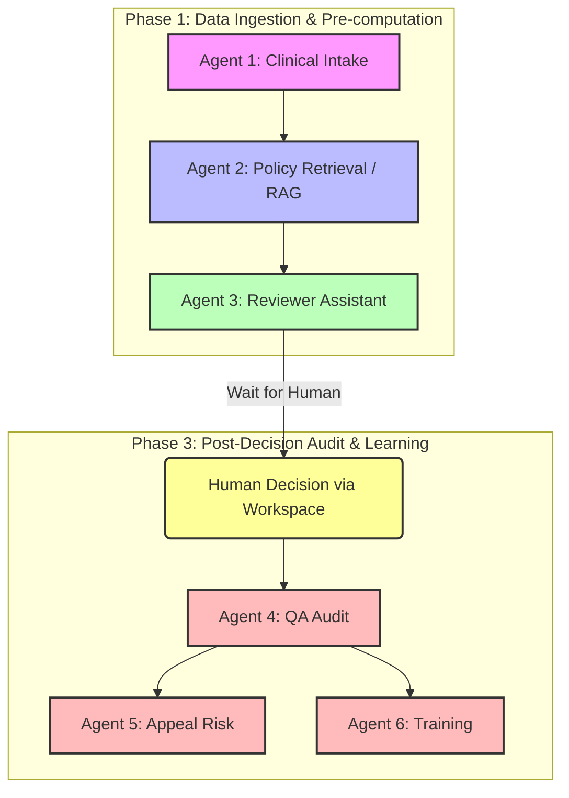

# CareAudit AI — Comprehensive System Architecture

**Tagline:** CareAudit Intelligence  
**Core Philosophy:** AI prepares → Human decides → AI audits → Organization learns

This document is the **definitive guide** to the CareAudit AI system. It explains the entire application lifecycle, from raw data ingestion to frontend user interactions. It describes exactly what happens when a user clicks a button and traces the data flow through every file in the architecture.

---

## 1. System Flow & Data Ingestion (End-to-End)

The architecture is built on a Human-in-the-Loop (HITL) AI workflow. Here is the step-by-step process of how data moves through the system:

### Phase 1: Data Ingestion & Pre-computation (AI Prepares)
1. **Document Upload & Case Creation (`POST /api/v1/cases/`)**
   - **Frontend:** A user (or automated system) uploads a patient's medical record (PDFs, EMR extracts).
   - **Backend:** The `cases.py` router receives the request. It inserts a new record into the DuckDB `cases` table with status `PENDING_REVIEW`.
2. **Pipeline Trigger (`POST /api/v1/cases/{id}/trigger-pipeline`)**
   - **Backend:** The API triggers the LangGraph pipeline defined in `app/agents/graph.py`. The `AgentState` object is initialized.
3. **Agent 1: Clinical Intake (`clinical_intake_agent.py`)**
   - **Action:** Reads the raw OCR text from `documents`. It prompts the Groq LLM to extract vital signs, lab results, a chronological clinical timeline, and primary diagnoses.
   - **Output:** Saves a heavily structured JSON object (`structured_case`) into the `cases` table.
4. **Agent 2: Policy Retrieval / RAG (`policy_agent.py`)**
   - **Action:** Uses the primary diagnosis (e.g., CHF) to query the vector database (ChromaDB). It retrieves chunks of clinical guidelines.
   - **Action:** Prompts the LLM to map the exact clinical evidence found by Agent 1 against the specific criteria sections of the policy.
   - **Output:** Saves a `policy_matches` JSON object to the DuckDB `policy_matches` table, flagging which criteria are "MET" or "UNMET".
5. **Agent 3: Reviewer Assistant (`reviewer_assistant_agent.py`)**
   - **Action:** Generates a short, conversational "AI Copilot Observation" (e.g., "Patient meets 3 of 4 inpatient criteria...").
   - **Output:** Pauses the graph. The system waits for human intervention.

### Phase 2: The Human Decision (Human Decides)
1. **Frontend Workspace (`/workspace`):** The Nurse logs in and opens the case. The Next.js frontend fetches the pre-computed `structured_case` and `policy_matches` via `GET /api/v1/workspace/queue`.
2. **User Interaction:** The nurse reviews the 3-panel UI, clicks the "Approve", "Deny", or "Escalate" button, types a rationale, and clicks "Submit Decision".
3. **Backend Submission (`POST /api/v1/workspace/{id}/decision`)**:
   - The `nurse_workspace.py` router saves the decision and rationale to the `nurse_decisions` table.
   - It updates the `AgentState` with `decision_submitted = True`.
   - It **resumes** the LangGraph pipeline.

### Phase 3: Post-Decision Audit & Learning (AI Audits & Learns)
1. **Agent 4: QA Audit (`qa_audit_agent.py`)**
   - **Action:** The LLM acts as an auditor. It reads the nurse's rationale and compares it against the facts (Agent 1) and policy (Agent 2).
   - **Output:** Generates a 0-100 QA Score across 4 dimensions (Accuracy, Documentation, Compliance, Consistency). Saves findings (e.g., "Missed citing O2 saturation") to the `audit_results` table.
2. **Agent 5: Appeal Risk (`appeal_risk_agent.py`)**
   - **Action:** If the decision was a "Denial", this agent predicts the probability of a payer overturning the denial upon appeal based on the clinical facts.
   - **Output:** Saves the overturn probability and financial exposure to the `appeals` table.
3. **Agent 6: Training (`training_agent.py`)**
   - **Action:** Analyzes the QA findings from Agent 4. If a knowledge gap is detected (e.g., poor understanding of Observation vs. Inpatient rules), it generates a personalized micro-learning module.
   - **Output:** Saves the module to the `training_modules` table and assigns it to the nurse.

---

## 2. Directory Structure & File Breakdown

### Backend (`backend/`)
* **`app/main.py`:** The FastAPI entrypoint. Mounts the CORS middleware to allow localhost:3001, mounts the `AuditLogMiddleware` (which intercepts every click/request and logs it for HIPAA), initializes the DuckDB connection on startup, and registers the `/api/v1` router.
* **`app/database.py`:** Manages the DuckDB connection (`get_connection()`). Contains the massive `init_database()` function that creates all 12 SQL tables (users, cases, policies, policy_matches, nurse_decisions, audit_results, appeals, reviewer_stats, training_modules, conversations, messages, audit_log).
* **`app/config.py`:** Uses Pydantic `BaseSettings` to load environment variables (Groq Key, JWT Secret).
* **`app/core/security.py`:** Implements `bcrypt` for password hashing (verifying user logins) and `python-jose` for creating JWT access tokens.
* **`app/core/middleware.py`:** Contains `AuditLogMiddleware`. Every time a user clicks anything that triggers an API call, this file intercepts the request, grabs the user's IP and JWT ID, and writes an immutable record to the `audit_log` table.
* **`app/api/v1/...` (The Routers):** 
  * `auth.py`: Handles `/login` by checking the database and returning a JWT.
  * `cases.py`: Handles CRUD for cases and triggering the LangGraph pipeline.
  * `nurse_workspace.py`: Serves the highly structured JSON needed to render the 3-panel nurse workspace. Accepts the human decision.
  * `audit.py`, `appeal.py`, `executive.py`, `analytics.py`: Read-only endpoints that run aggregate SQL queries to power the frontend dashboards.
* **`app/agents/graph.py`:** The heart of the AI. Defines a `StateGraph`. Nodes are connected sequentially (Agent 1 → 2 → 3 → WAIT → 4 → 5 → 6).
* **`scripts/seed_database.py`:** Extremely important script. Wipes the DB and creates 6 users, 5 policies, and 4 demo cases. It manually injects the JSON outputs that the AI agents *would* generate so the UI can be demonstrated immediately.

### Frontend (`frontend/src/`)
* **`app/globals.css`:** The design system. Defines CSS variables (`--brand-primary: #E8521A`), button styles (`.btn-primary`), card styles, and animations (`@keyframes pulse`).
* **`lib/api.ts`:** An Axios client instance. It contains an interceptor that automatically attaches the JWT token from `localStorage` to every request. If a 401 Unauthorized is returned, it forces a logout.
* **`store/authStore.ts`:** A Zustand state manager. When a user logs in, it stores their data globally in memory and saves the token to browser `localStorage` so they stay logged in upon refresh.

---

## 3. Frontend UI Interactions: What Every Click Does

### 1. Landing Page (`/`)
* **Purpose:** A marketing/entry page.
* **"Ask AI" Search Bar:** A visual input. Typing and hitting enter redirects the user to the `/chat` conversational interface, passing the query along.
* **KPI Cards:** Display static metrics representing the value of the platform.
* **"Go to Dashboard" / "Sign In" Button:** Redirects the user to `/login`.

### 2. Login Page (`/login`)
* **Purpose:** Authentication.
* **"Sign In" Button Click:**
  1. Prevents default form submission.
  2. Calls `login(email, password)` in `authStore.ts`.
  3. The store uses Axios (`api.ts`) to send a `POST` request to `http://localhost:8000/api/v1/auth/login`.
  4. Backend `auth.py` hashes the password using `bcrypt` and compares it to the DuckDB `users` table.
  5. Returns a JWT. Frontend saves it to `localStorage`.
  6. Router redirects the user to `/chat`.

### 3. Dashboard Shell & Navigation (`/layout.tsx`)
* **Purpose:** The persistent sidebar.
* **Nav Links (Cases, Workspace, Audit, etc.):** Clicking these uses Next.js client-side routing to instantly swap the right-side content panel without a full page reload.
* **User Avatar (Bottom Left):** Displays the initials of the logged-in user.
* **Logout Button:** Clears `localStorage` and redirects to `/login`.

### 4. Cases List (`/cases`)
* **Purpose:** A queue of all patient cases.
* **Status Badges:** Color-coded (Green for Audited, Yellow for Pending).
* **Row Click:** Clicking a case card navigates the user to `/workspace` (in a real app, it would pass the `case_id` as a URL parameter like `/workspace?id=CASE-001`).

### 5. Nurse Workspace (`/workspace`)
* **Purpose:** The core 3-panel review interface.
* **Data Load:** On mount, it sends a `GET /api/v1/workspace/queue`. The backend joins the `cases` and `policy_matches` tables and returns the structured data.
* **Left Panel (Patient Data):** Displays static demographic info and risk badges.
* **Center Panel (Timeline/Vitals):** Renders the chronological timeline array. Checks vital sign values (e.g., O2 Sat = 84) against thresholds and renders them in RED if abnormal.
* **Right Panel (Policy Intelligence):** Renders the mapped policy criteria. Green checkmarks mean the AI found evidence.
* **"Approve" / "Deny" Buttons:** Clicking these highlights the button and sets local React state (`selectedDecision`).
* **"Submit Decision" Button:** 
  1. Validates that a decision was selected and a rationale was typed.
  2. Sends a `POST /api/v1/workspace/case-id/decision` with the rationale.
  3. The backend saves this, which unblocks the LangGraph pipeline (Agents 4, 5, 6 will now run in the background).
  4. Frontend shows a success toast and clears the form.

### 6. QA Audit Report (`/audit`)
* **Purpose:** Shows the results of Agent 4 (QA).
* **Gauge Chart:** A CSS conic-gradient circle that visually represents the 0-100 QA Score.
* **Progress Bars:** Renders the 4 sub-scores (Accuracy, Documentation, etc.) using width percentages.
* **AI Findings List:** Iterates over the AI's identified gaps. Red/Yellow borders are applied dynamically based on the `severity` attribute of the finding (Critical vs Low).

### 7. Executive Command Center (`/executive`)
* **Purpose:** C-Suite bird's-eye view.
* **Data Load:** Queries `GET /api/v1/executive/dashboard`. The backend runs heavy SQL aggregations over the `audit_results` and `appeals` tables to calculate organization-wide averages.
* **Trend Chart:** A custom CSS area chart that maps 12 months of QA scores to Y-axis heights.

### 8. Appeal Risk Dashboard (`/appeal`)
* **Purpose:** Financial exposure management (Output of Agent 5).
* **Data Table:** Lists denied cases.
* **Risk Progress Bar:** The "Overturn Probability" column renders a visual bar. If probability > 70%, the bar turns red.

### 9. Training Hub (`/training`)
* **Purpose:** Micro-learning generated by Agent 6.
* **Module Cards:** Displays the topic, estimated time, and why it was triggered (e.g., "Documentation completeness score consistently below 75%").
* **"Start Module" Button:** (Mocked) Would open the interactive quiz/case study interface.

### 10. Agent Pipeline (`/agent-pipeline`)
* **Purpose:** Transparency into the LangGraph AI.
* **Visualization:** Reads from a WebSocket or static endpoint to show the 6 agents.
* **Status Indicators:** If an agent is running, it pulses blue. If complete, it shows a green checkmark and the actual JSON output snippet generated by that specific agent.

## 11. Agent Pipeline Architecture

The LangGraph AI workflow is structured as follows:

---
*End of Document.*
